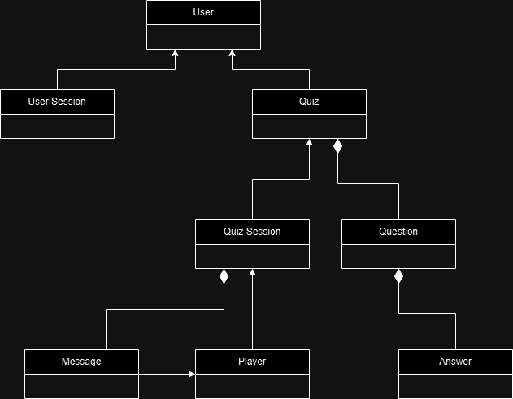
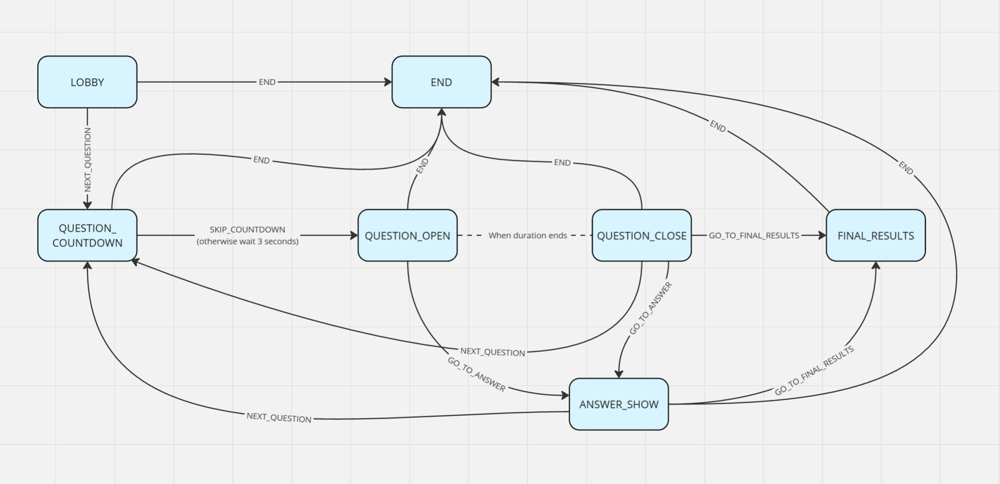

# Amandine Backend

## Introdutin

Amandine is a platform for creating and taking quizzes. It provides users with an intuitive interface to design their own quizzes, share them with others, and track performance. Whether you are an educator looking to assess your students or a trivia enthusiast wanting to challenge friends, Amandine offers a versatile solution. With features such as customizable questions, real-time feedback, and analytics, users can enhance their learning and engagement through interactive quiz experiences.

## Tech Stack

- Node.js
- Express
- TypeScript
- Jest

## Data Structure Diagram

User data is directly stored in memory and JSON files. This project follows the basic OOP principles. A simple class diagram is provided below. You can find the full detail of classes in the [here](./src/models/Classes.ts).

## Game State Diagram

A quiz session is a active quiz game session. Administrators can create a quiz session and share it with players. Players can join a quiz session and take the quiz. Admin can change the state of the quiz session following the state diagram below.

